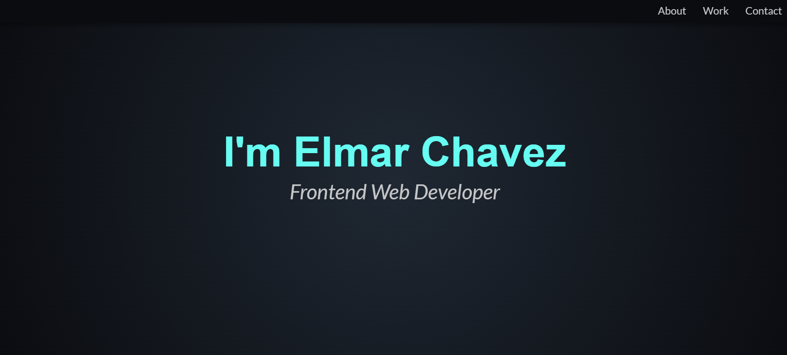

# 💻 Personal Portfolio

## ℹ️ Personal Portfolio Website

A sleek and responsive portfolio website to showcase my early frontend projects which includes an about section, project gallery, and a contact section with placeholder links to social profiles.

It was built entirely with HTML and CSS as part of the [**freeCodeCamp.org**](https://www.freecodecamp.org/learn/full-stack-developer/) CSS course.

---

## 🔍 Overview

This website serves as an example personal portfolio website, designed to present who I am as a budding frontend developer. It provides an overview of the projects I’ve built so far and invites potential collaborators to get in touch.

From layout structure to responsive behaviors, every section is carefully crafted with clean design and accessibility in mind. I also included a subtle dark-themed aesthetic using `radial-gradient` backgrounds and hover interactions for a more modern UI feel.

---

## ✨ Features

- Fully responsive layout for desktops and tablets
- Fixed navigation bar with smooth scrolling to sections
- Grid-based project gallery showcasing six early projects
- Button with hover animation and accessible text
- Contact section with icon-based social links
- Footer with disclaimers and author credit
- Custom CSS variables and media queries for maintainability

---

## 🧠 What I Learned

- Structuring a semantic HTML layout from scratch
- Styling using CSS custom properties (variables)
- Implementing media queries for responsive behavior
- Designing fixed navigation with hover and active states
- Organizing projects using CSS Grid layout
- Applying accessibility best practices in links and interactions
- Enhancing visual UI using transitions and gradients

---

## 🛠️ Tech Used

- HTML5
- CSS3
- Git
- GitHub
- Netlify

---

## 🚀 How to Run

1. Clone the repository
2. Open `index.html` in your browser

---

## 🌐 Live Demo

Or you can check out the 👉 [live website here](https://personal-portfolio-fcc-jiro.netlify.app/)

---

## 🧑‍💻 Author

Created by **Elmar Chavez**

🗓️ Month/Year: **May 2025**

📚 Journey: **2nd** month of learning _frontend web development_.
